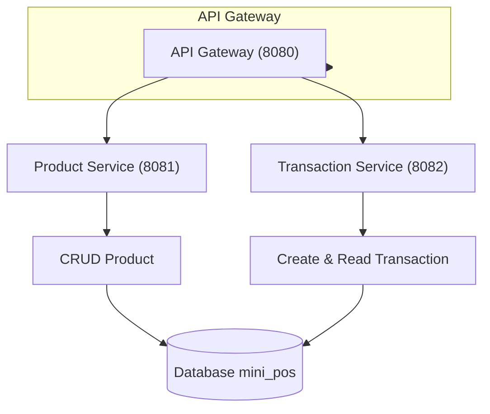

# Mini POS System

A simple Point of Sale (POS) system built with Go, PostgreSQL, and RESTful API architecture. This system provides essential functionality for managing products, processing sales transactions, and generating comprehensive reports.

## 📋 Features

### 1. Product Management
- **CRUD Operations**: Create, read, update, and delete products
- **Inventory Tracking**: Real-time stock management with automatic updates
- **Product Information**: Store product details including name, price, and stock quantity
- **Soft Delete**: Products are soft-deleted to maintain transaction history
- **Low Stock Alerts**: Automatic alerts for products with low inventory

### 2. Sales Transactions
- **Transaction Processing**: Handle complete sales transactions with multiple items
- **Real-time Stock Updates**: Automatic inventory reduction upon successful sales
- **Stock Validation**: Prevent overselling with stock availability checks
- **Transaction History**: Complete audit trail of all sales activities

### 3. Comprehensive Reporting
- **Overall Transaction Reports**: 
  - Total sales summary with date ranges
  - Transaction volume and value analysis
  - Daily, weekly, and monthly sales trends


## 🏗️ Microservices Architecture

The system follows a clean architecture pattern with clear separation of concerns:


## 🏗️ Backend Layer Architecture


This project implements a Repository-Service Pattern with a clean separation of concerns. The architecture consists of:
- Router → Handles client requests and routes them to the correct controller.
- Controller/Handler → Manages request/response flow and delegates tasks to the use case layer.
- Use Case/Service → Contains the application logic and orchestrates interactions between repository and domain.
- Repository → Abstracts data persistence and communicates with the database.
- Domain/Model/Entity/DTO → Defines the core business rules and entities, independent of external layers.

This structure makes the codebase more maintainable, testable, and scalable, ensuring flexibility for future growth.

## 🗄️ Database Schema

### Core Tables
- **products**: Product catalog with pricing and inventory
- **transactions**: Sales transaction headers
- **transaction_items**: Individual items within transactions

### Built-in Views
- `v_transaction_summary`: Aggregated transaction overview
- `v_product_sales_report`: Product performance analytics
- `v_low_stock_alert`: Inventory management alerts

## 🚀 Quick Start

### Prerequisites
- Go 1.19 or higher
- PostgreSQL 13 or higher
- Docker and Docker Compose (optional)

### Database Setup
1. Create PostgreSQL database:
```sql
CREATE DATABASE mini_pos;
```

2. Import file migration.sql


### Running the Application

#### Using Docker Compose (Recommended)
```bash
# Start all services
docker-compose up -d
```
```bash
# View logs
docker-compose logs -f
```

### Manual Setup

#### Start Product Service
```bash
cd product-service
```
```bash
go mod tidy
```
```bash
go run main.go
```

### Start Transaction Service (in new terminal)
```bash
cd transaction-service
```
```bash
go mod tidy
```
```bash
go run main.go
```

### Start API Gateway (in new terminal)
```bash
cd api-gateway
```
```bash
go mod tidy
```
```bash
go run main.go
```

## 📡 API Documentation

[](https://documenter.getpostman.com/view/47104640/2sB3HgRPG5)


## 🤝 Contributing

This project is for demonstration and technical test purposes. However, feedback and suggestions are welcome.


## 📋 Submission Requirements

This project fulfills all required submission criteria:

### ✅ Working API with All Endpoints
- **Product Management API**: Full CRUD operations for products
- **Transaction Processing API**: Complete sales transaction handling
- **Reporting API**: Comprehensive analytics and reporting endpoints
- **Health Check Endpoints**: Service monitoring and status verification
- **Error Handling**: Proper HTTP status codes and error responses

### ✅ Database Schema/Setup Files
- **migration.sql**: Complete database schema with tables, indexes, and sample data
- **Automated Setup**: One-command database initialization
- **Data Integrity**: Constraints, triggers, and referential integrity
- **Performance Optimization**: Strategic indexes and views
- **Sample Data**: Ready-to-use test data for immediate functionality

### ✅ README with Setup Instructions
- **Comprehensive Documentation**: Detailed setup and usage instructions
- **Multiple Deployment Options**: Docker Compose and manual setup
- **Environment Configuration**: Clear configuration guidelines
- **API Documentation**: Complete endpoint reference
- **Troubleshooting Guide**: Common issues and solutions

### ✅ Example API Calls and Test Data
Complete API testing examples provided below with sample requests and responses.


